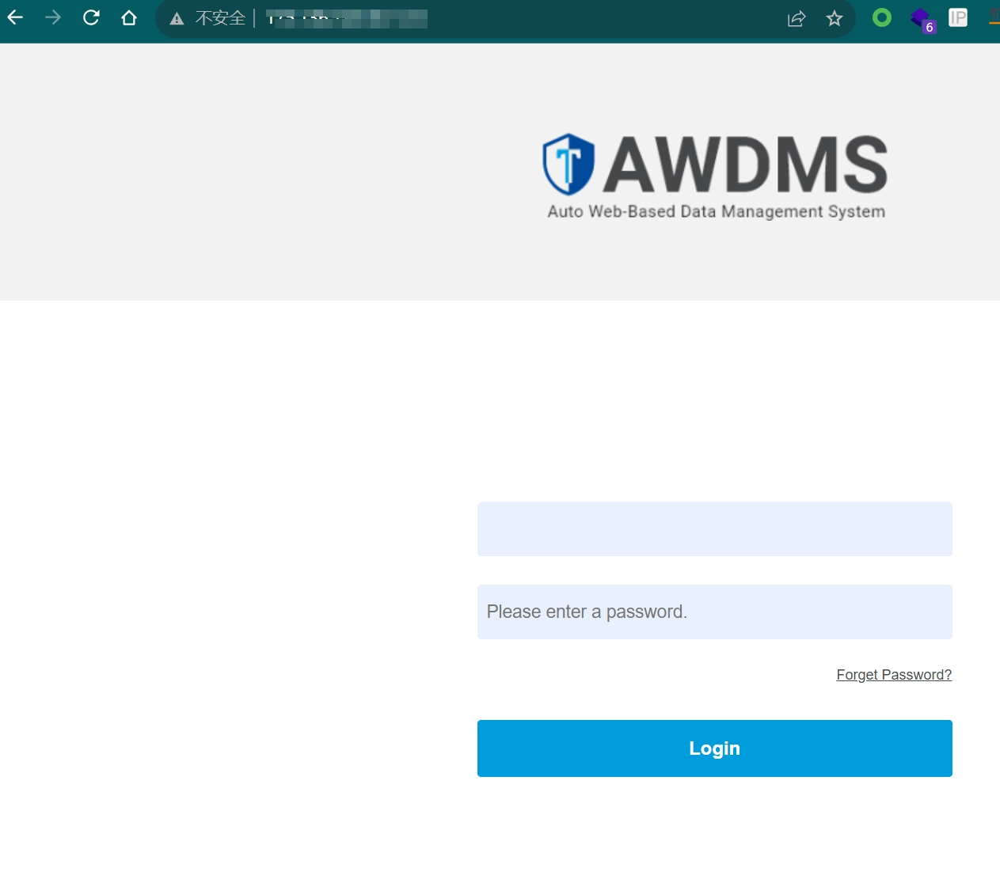
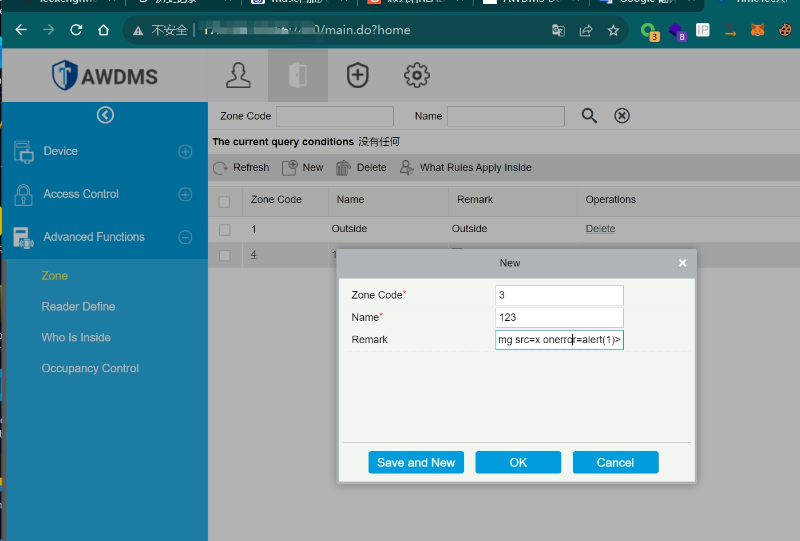
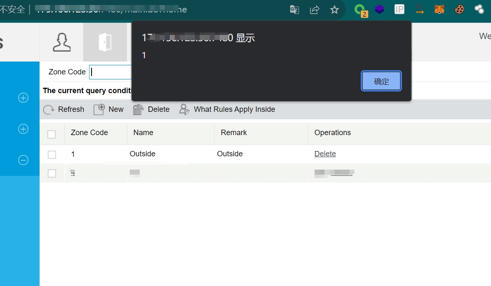

# TimeTec_Cloud_AWDMS(Storage XSS)

Description of product : The TimeTec AWDMS is an online application that offers Application Programming Interface (API) for third-party application developers to integrate with TimeTec terminals; to retrieve user information, biometric data, transaction logs, and TimeTec devices information.

> [Vulnerability Type]
> Cross Site Scripting (XSS)
>
> ------------------------------------------
>
> [Vendor of Product]
> timetec
>
> ------------------------------------------
>
> [Affected Product Code Base]
> AWDMS - 2.0
>
> ------------------------------------------
>
> [Attack Type]
> Context-dependent
>
> ------------------------------------------
>
> [Impact Information Disclosure]
> true
>
> ------------------------------------------
>
> [Attack Vectors]
> payload:``
>
Description of vulnerability : I found a stored XSS vulnerability after logging in to the system.

Affected Webpage : Backend page

Step 1 : Find the website and log in using the weak password admin/admin.
The website title is "TimeTec Cloud AWDMS", which is the characteristic of his website.

Step 2 : Find the Zone in the advanced features, create a new one here and add our xss payload to trigger the storage vulnerability.
The padyload is ``

Step3: Depart successfully after saving.

